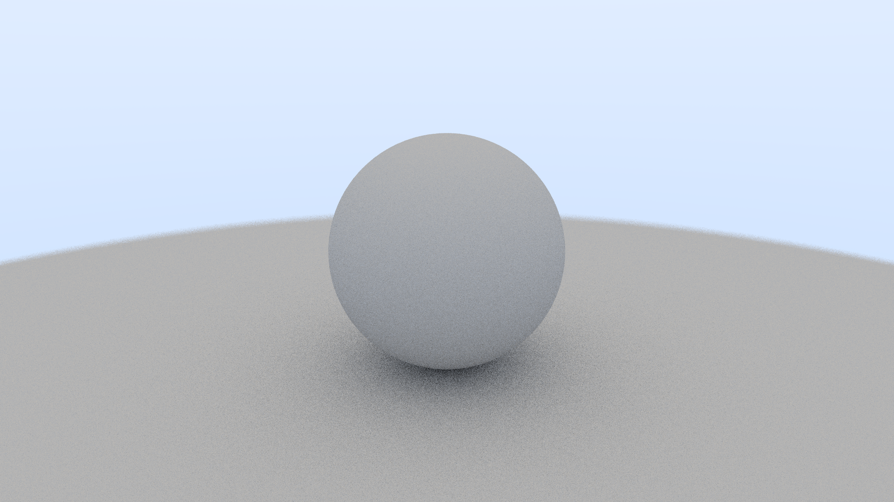

<center><h1>Cray: a Simple C RayTracer</h1></center>

<center></center>

<center>
    <b>Cray</b> is a simple <b>RayTracer</b> made in C following <a href="https://raytracing.github.io/books/RayTracingInOneWeekend.html">Ray Tracing in One Weekend</a>.</br>
    The project has been Extended for <b>Multithreaded Tile Rendering</b>.
</center>

## Build (Linux Only)

```sh
mkdir build && cd build
cmake ..
make
```

## Launch

```sh
cd build
./cray
```